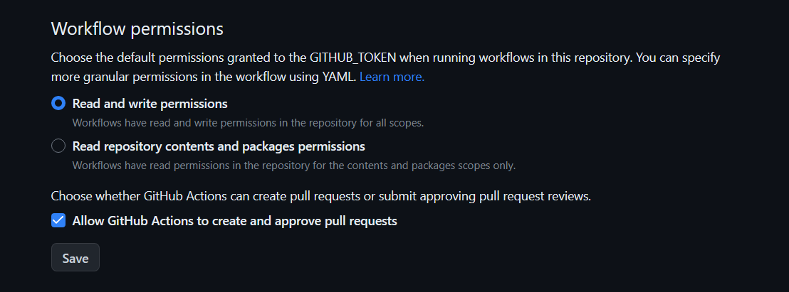

# SiYuan plugin sample with vite and svelte

[中文版](./README.zh-CN.md)

> Based on [siyuan/plugin-sample](https://github.com/siyuan-note/plugin-sample) [v0.5.0](https://github.com/siyuan-note/plugin-sample/tree/v0.5.0), with selected updates from newer releases.


1. Using vite for packaging
2. Use symbolic linking instead of putting the project into the plugins directory program development
3. Built-in support for the svelte framework

     > **If don't want svelte, turn to this template**: [frostime/plugin-sample-vite](https://github.com/frostime/plugin-sample-vite)
     >
     > **We also provide with a vite+solidjs template**: [frostime/plugin-sample-vite-solidjs](https://github.com/frostime/plugin-sample-vite-solidjs)
     >
     > ⚠️ These alternative templates are provided for reference and may not receive updates as promptly as this template.

4. Provides a github action template to automatically generate package.zip and upload to new release
5. Includes a visual External Capture Service demo for SiYuan Kernel Plugins


## Svelte version

The current version of this template uses **Svelte 5**. It is the recommended choice for new plugins and uses the runes-based API such as `$props`, `$state`, and snippets.

The previous Svelte 4 implementation is preserved as the **`legacy-svelte4`** tag ([view it on GitHub](https://github.com/siyuan-note/plugin-sample-vite-svelte/tree/legacy-svelte4)). If your plugin depends on Svelte 4 APIs or compatibility behavior, switch to this tag before creating your plugin from the template.

The `legacy-svelte4` tag is retained as a stable reference for existing users and compatibility needs. New development uses Svelte 5.


## Get started

1. Use the <kbd>Use this template</kbd> button to make a copy of this repo as a template. The repository name should match the plugin name. The generated project uses Svelte 5. If you need Svelte 4 compatibility, start from the stable `legacy-svelte4` tag instead.
2. Clone your repository to the local development folder.
    * Note: Unlike `plugin-sample`, this example does not recommend directly downloading the code to `{workspace}/data/plugins/`.
3. Install Node.js 24 or later and pnpm 11.4, then run `pnpm i` in the development folder to install the required dependencies.
4. Run the `pnpm run make-link` command to create a symbolic link (Windows developers, please refer to the "make-link on Windows" section below).
5. Execute `pnpm run dev` for real-time compilation. In development mode, the generated app bundle connects to the local LiveReload server and asks the current SiYuan window to reload this plugin only.

   The default LiveReload debounce is 300 ms and the default delay between disabling and re-enabling the plugin is 500 ms. You can customize them before starting development:

   ```powershell
   $env:SIYUAN_LIVERELOAD_PORT = "35740"
   $env:SIYUAN_LIVERELOAD_DEBOUNCE_MS = "300"
   $env:SIYUAN_PLUGIN_RELOAD_GAP_MS = "500"
   $env:SIYUAN_LIVERELOAD_MESSAGE = "Current check item already exists"
   pnpm run dev
   ```

   Use `SIYUAN_PLUGIN_DIR` to bind `dev` to a specific workspace instead of selecting a workspace by index.
6. Open the marketplace in SiYuan and enable the plugin in the download tab.

### Setting the Target Directory for the make-link Command

The `make-link` command creates a symbolic link that binds your `dev` directory to the SiYuan plugin directory. You can configure the target SiYuan workspace and create the symbolic link in three ways:

1. **Select Workspace**
    - Open SiYuan, ensure the SiYuan kernel is running.
    - Run `pnpm run make-link`, the script will automatically detect all SiYuan workspaces, please manually enter the number to select the workspace.
        ```bash
        >>> pnpm run make-link
        > plugin-sample-vite-svelte@0.0.3 make-link H:\SrcCode\开源项目\plugin-sample-vite-svelte
        > node  --no-warnings ./scripts/make_dev_link.js

        "targetDir" is empty, try to get SiYuan directory automatically....
        Got 2 SiYuan workspaces
        [0] H:\Media\SiYuan
        [1] H:\临时文件夹\SiYuanDevSpace
        Please select a workspace[0-1]: 0
        Got target directory: H:\Media\SiYuan/data/plugins
        Done! Created symlink H:\Media\SiYuan/data/plugins/plugin-sample-vite-svelte
        ```
2. **Manually Configure Target Directory**
    - Open the `./scripts/make_dev_link.js` file, change `targetDir` to the SiYuan plugin directory `<siyuan workspace>/data/plugins`.
    - Run the `pnpm run make-link` command. If you see a message similar to the one below, it indicates successful creation:

3. **Set Environment Variable to Create Symbolic Link**
    - Set the system environment variable `SIYUAN_PLUGIN_DIR` to the path `workspace/data/plugins`.

### make-link on Windows

Due to SiYuan upgrading to Go 1.23, the old version of junction links cannot be recognized normally on Windows, so it has been changed to create `dir` symbolic links.

> https://github.com/siyuan-note/siyuan/issues/12399

However, creating directory symbolic links on Windows using NodeJs may require administrator privileges. You have the following options:

1. Run `pnpm run make-link` in a command line with administrator privileges.
2. Configure Windows settings, enable developer mode in [System Settings - Update & Security - Developer Mode] then run `pnpm run make-link`.
3. Run `pnpm run make-link-win`, this command will use a PowerShell script to request administrator privileges, requiring the system to enable PowerShell script execution permissions.

## I18n

In terms of internationalization, our main consideration is to support multiple languages. Specifically, we need to
complete the following tasks:

* Meta information about the plugin itself, such as plugin display name, description and readme
    * `displayName`, `description` and `readme` fields in plugin.json, and the corresponding README*.md file
* Text used in the plugin, such as button text and tooltips
    * public/i18n/*.json language configuration files
    * Use `this.i18.key` to get the text in the code
* YAML Support
  * This template specifically supports I18n based on YAML syntax, see `public/i18n/zh-CN.yaml`
  * During compilation, the defined YAML files will be automatically translated into JSON files and placed in the dist or dev directory.

It is recommended that the plugin supports at least English and Simplified Chinese, so that more people can use it more
conveniently. Unsupported languages do not need to be declared in the `displayName`, `description` and `readme` fields in plugin.json.

## Kernel Plugin

A Kernel Plugin is the service part of a plugin that runs with the SiYuan kernel instead of belonging to one dialog, dock, or editor instance. Use it when service state and lifecycle should remain owned by the running kernel, when several trusted clients need one service, or when a plugin needs to expose an authenticated RPC/HTTP interface or Agent capability.

This template demonstrates that boundary with an **External Capture Service**. A local CLI, reader integration, browser extension, or the Svelte GUI can send captured text to one domain endpoint. The Kernel Plugin owns the target-notebook configuration, previews or writes the content to today's Daily Note, records committed captures, and notifies an open frontend. Open **Kernel Plugin Example: External Capture Service** from the plugin's top-bar menu to try the complete flow and copy a terminal command for your operating system.

The endpoint requires SiYuan administrator authentication. The workspace API token is not a capture-only credential. Do not expose it to untrusted software or directly to the Internet.

- Follow [Run the capture service without its UI](./docs/kernel-capture-demo.md) to see the Kernel service continue after its panel closes.
- Read [Why a Kernel Plugin is a service](./docs/kernel-plugin.md) for the runtime and ownership model.
- Use [plugin-sample v0.5.0](https://github.com/siyuan-note/plugin-sample/tree/v0.5.0) for complete Agent capability, RPC batch, WebSocket, SSE, and storage watcher examples.

## plugin.json

```json
{
  "name": "plugin-sample-vite-svelte",
  "author": "frostime",
  "url": "https://github.com/siyuan-note/plugin-sample-vite-svelte",
  "version": "0.5.1",
  "minAppVersion": "3.7.0",
  "kernels": [
    "windows",
    "linux",
    "darwin",
    "ios",
    "android",
    "harmony",
    "docker",
    "all"
  ],
  "disabledInPublish": true,
  "backends": [
    "windows",
    "linux",
    "darwin",
    "ios",
    "android",
    "harmony",
    "docker"
  ],
  "frontends": [
    "desktop",
    "mobile",
    "browser-desktop",
    "browser-mobile",
    "desktop-window"
  ],
  "displayName": {
    "default": "Plugin sample with vite and svelte",
    "zh-CN": "插件样例 vite + svelte 版"
  },
  "description": {
    "default": "SiYuan plugin sample with vite and svelte",
    "zh-CN": "使用 vite 和 svelte 开发的思源插件样例"
  },
  "readme": {
    "default": "README.md",
    "zh-CN": "README.zh-CN.md"
  },
  "icon": "icon.png",
  "preview": "preview.png",
  "funding": {
    "openCollective": "",
    "patreon": "",
    "github": "",
    "custom": [
      "https://ld246.com/sponsor"
    ]
  },
  "keywords": [
    "sample",
    "示例"
  ]
}
```

* `name`: Plugin name, must be the same as the repo name, and must be unique globally (no duplicate plugin names in the
  marketplace)
* `author`: Plugin author name
* `url`: Plugin repo URL
* `version`: Plugin version number, it is recommended to follow the [semver](https://semver.org/) specification
* `minAppVersion`: Minimum version number of SiYuan required to use this plugin
* `kernels`: Kernel environments required by the kernel plugin, optional values are `windows`, `linux`, `darwin`, `docker`, `android`, `ios`, `harmony` and `all`
* `backends`: Backend environment required by the plugin, optional values are `windows`, `linux`, `darwin`, `docker`, `android`, `ios` and `all`
  * `windows`: Windows desktop
  * `linux`: Linux desktop
  * `darwin`: macOS desktop
  * `docker`: Docker
  * `android`: Android APP
  * `ios`: iOS APP
  * `all`: All environments
* `frontends`: Frontend environment required by the plugin, optional values are `desktop`, `desktop-window`, `mobile`, `browser-desktop`, `browser-mobile` and `all`
  * `desktop`: Desktop
  * `desktop-window`: Desktop window converted from tab
  * `mobile`: Mobile APP
  * `browser-desktop`: Desktop browser
  * `browser-mobile`: Mobile browser
  * `all`: All environments
* `displayName`: Plugin name (plain text), displayed in the marketplace list, supports multiple languages
    * `default`: Default language, must exist
    * `zh-CN`, `en` and other languages: optional, must be [BCP 47](https://tools.ietf.org/html/bcp47) tags (e.g. `zh-CN`, `zh-TW`, `en`, `ja`, `pt-BR`)
* `description`: Plugin description (plain text), displayed in the marketplace list, supports multiple languages
    * `default`: Default language, must exist
    * `zh-CN`, `en` and other languages: optional, must be BCP 47 tags
* `readme`: readme file name, mainly used to display in the marketplace details page, supports multiple languages
    * `default`: Default language, must exist
    * `zh-CN`, `en` and other languages: optional, must be BCP 47 tags
    * Relative images are loaded from `package.zip` when present; otherwise the online marketplace falls back to the matching GitHub Release. Include them in `package.zip` for offline use
* `icon`: Optional marketplace icon filename at the package root. Supports PNG, JPEG, WebP, and AVIF up to 64 KiB; the recommended size is 160*160
* `preview`: Optional marketplace preview filename at the package root. Supports PNG, JPEG, WebP, and AVIF up to 512 KiB; the recommended size is 1024*768
    * SVG is unsupported. To omit an image, remove its field and the legacy `icon.png` or `preview.png`; an empty field value is invalid
* `funding`: Plugin sponsorship information
    * `openCollective`: Open Collective name
    * `patreon`: Patreon name
    * `github`: GitHub login name
    * `custom`: Custom sponsorship link list
    * `links`: Labeled custom sponsorship links, for example `{"label": "Sponsor", "url": "https://example.com"}`
* `keywords`: Search keyword list, used for marketplace search function

## Package

No matter which method is used to compile and package, we finally need to generate a package.zip, which contains at
least the following files:

* i18n/*
* Image files declared by `icon` and `preview` (optional)
* index.css
* index.js
* kernel.js
* plugin.json
* README*.md
* asset/* (README images required offline)

## List on the marketplace

* `pnpm run build` to generate package.zip
* Create a new GitHub release using your new version number as the "Tag version". See here for an
  example: https://github.com/siyuan-note/plugin-sample/releases
* Upload the file package.zip as binary attachments
* Publish the release

If it is the first release, please create a pull request to
the [Community Bazaar](https://github.com/siyuan-note/bazaar) repository and modify the plugins.json file in it. This
file is the index of all community plugin repositories, the format is:

```json
{
  "repos": [
    "username/reponame"
  ]
}
```

After the PR is merged, the bazaar will automatically update the index and deploy through GitHub Actions. When releasing
a new version of the plugin in the future, you only need to follow the above steps to create a new release, and you
don't need to PR the community bazaar repo.

Under normal circumstances, the community bazaar repo will automatically update the index and deploy every hour,
and you can check the deployment status at https://github.com/siyuan-note/bazaar/actions.

## Use Github Action

The github action is included in this sample and can build and publish a GitHub release automatically.

1. In your repository, open `Settings` > `Actions` > `General`. Under **Workflow permissions**, select **Read and write permissions** and save the setting. This repository setting allows the workflow's `GITHUB_TOKEN` to create or update releases. The workflow also declares the required `contents: write` permission in `.github/workflows/release.yml`.

    

2. Update the `version` fields in `package.json` and `plugin.json`, then push a tag in the format `v*` with the same version, for example:

    ```bash
    git tag v0.5.1
    git push origin v0.5.1
    ```

    The workflow removes the `v` prefix and verifies that the tag version matches both JSON files before checking, building, or publishing.

3. The current workflow creates a regular release (`prerelease: false`). Pre-release publishing remains supported: set `prerelease: true` in `.github/workflows/release.yml` when a tag should create a pre-release.

    ```yaml
    - name: Release
      uses: ncipollo/release-action@v1
      with:
        allowUpdates: true
        artifactErrorsFailBuild: true
        artifacts: 'package.zip'
        token: ${{ secrets.GITHUB_TOKEN }}
        prerelease: false # set to true for a pre-release
    ```


## How to remove svelte dependencies

> Pure vite without svelte: https://github.com/frostime/plugin-sample-vite

This plugin is packaged in vite and provides a dependency on the svelte framework. However, in practice some developers may not want to use svelte and only want to use the vite package.

In fact you can use this template without using svelte without any modifications at all. The compilation-related parts of the svelte compilation are loaded into the vite workflow as plugins, so even if you don't have svelte in your project, it won't matter much.

If you insist on removing all svelte dependencies so that they do not pollute your workspace, you can perform the following steps. 1.

1. delete the
    ```json
    {
      "@sveltejs/vite-plugin-svelte": "^2.0.3",
      "@tsconfig/svelte": "^4.0.1",
      "svelte": "^3.57.0"
    }
    ```
2. delete the `svelte.config.js` file
3. delete the following line from the `vite.config.js` file
    - Line 6: `import { svelte } from "@sveltejs/vite-plugin-svelte"`
    - Line 20: `svelte(),`
4. delete line 37 of `tsconfig.json` from `"svelte"` 5.
5. re-run `pnpm i`

## Developer's Guide

Developers of SiYuan need to pay attention to the following specifications.

### 1. File Reading and Writing Specifications

If plugins or external extensions require direct reading or writing of files under the `data` directory, please use the kernel API to achieve this. **Do not call `fs` or other electron or nodejs APIs directly**, as it may result in data loss during synchronization and cause damage to cloud data.

Related APIs can be found at: `/api/file/*` (e.g., `/api/file/getFile`).

### 2. Daily Note Attribute Specifications

When creating a daily note in SiYuan, a custom-dailynote-yyyymmdd attribute will be automatically added to the document to distinguish it from regular documents.

> For more details, please refer to [Github Issue #9807](https://github.com/siyuan-note/siyuan/issues/9807).

Developers should pay attention to the following when developing the functionality to manually create Daily Notes:

* If `/api/filetree/createDailyNote` is called to create a daily note, the attribute will be automatically added to the document, and developers do not need to handle it separately
* If a document is created manually by developer's code (e.g., using the `createDocWithMd` API to create a daily note), please manually add this attribute to the document

