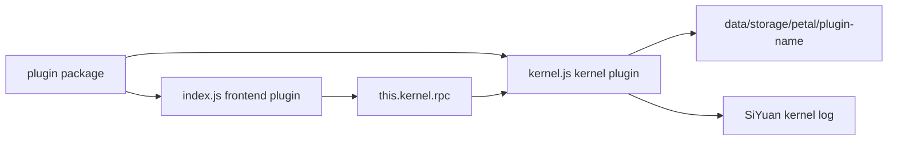

# Kernel Plugin Development

SiYuan 3.7.0 introduced kernel plugins. A plugin package can now include frontend code that runs in the SiYuan UI and kernel code that runs inside the SiYuan kernel process.

This template includes a minimal kernel plugin in `/src/kernel.ts`. For full API coverage, see the official complete sample: <https://github.com/siyuan-note/plugin-sample>.

## Glossary

| Term | Meaning in this template |
| --- | --- |
| kernel plugin | The `kernel.js` part of a plugin package, executed by the SiYuan kernel in a goja runtime. |
| frontend plugin | The `index.js` part of a plugin package, executed in the SiYuan frontend plugin environment. |
| goja runtime | The JavaScript runtime embedded in the SiYuan kernel. It is not a browser, Electron renderer, or Node.js process. |
| RPC | JSON-RPC bridge used by the frontend plugin to call methods registered by the kernel plugin. |
| MCP tool | A tool registered by a kernel plugin and exposed through SiYuan's MCP server. Not covered by the minimal sample. |
| private server handler | Kernel plugin HTTP/WS/SSE handlers under `/plugin/private/<plugin-name>/*path`. Not covered by the minimal sample. |

Use these terms consistently in docs and code comments. Avoid inventing translated aliases for them.

## Runtime Model



The kernel plugin starts when all conditions are true:

- The plugin is enabled.
- `plugin.json` has a `kernels` field matching the current backend or `all`.
- The package contains `kernel.js`.
- The current SiYuan version satisfies `minAppVersion`.

If `kernel.js` or `kernels` is missing, the package can still run as a frontend plugin.

## Package Layout

Build output should contain:

```text
plugin.json
index.js
index.css
kernel.js
i18n/*
README*.md
icon.png
preview.png
```

`plugin.json` declares kernel support:

```json
{
  "minAppVersion": "3.7.0",
  "kernels": ["windows", "linux", "darwin", "ios", "android", "harmony", "docker", "all"]
}
```

## Minimal Example

`/src/kernel.ts` demonstrates the high-frequency path:

- lifecycle hooks: `onload`, `onrunning`, `onunload`
- logging through `siyuan.logger`
- scoped storage through `siyuan.storage`
- frontend-to-kernel calls through `siyuan.rpc.bind`
- kernel-to-frontend notification through `siyuan.rpc.broadcast`

Frontend integration lives in `/src/index.ts`:

- `this.kernel.rpc.call.echo(...)` calls the kernel plugin.
- `this.kernel.rpc.call.readSampleStorage()` reads data written by the kernel plugin.
- `this.kernel.rpc.bind("notify", handler)` receives kernel notifications.
- `kernel-plugin-state-change` reports kernel plugin lifecycle state changes.

## Build

`vite.config.ts` has two build entries:

| Entry | Output | Runtime |
| --- | --- | --- |
| `/src/index.ts` | `index.js` | SiYuan frontend plugin environment |
| `/src/kernel.ts` | `kernel.js` | SiYuan kernel goja runtime |

Kernel output constraints:

- single JavaScript file
- no runtime `import`
- no DOM APIs such as `window` or `document`
- no Electron renderer APIs
- no direct Node.js filesystem access

Use `siyuan.storage`, `siyuan.client`, `siyuan.logger`, and `siyuan.rpc` instead of environment-specific APIs.

## Development

Run:

```bash
pnpm run dev
```

The dev build writes `dev/kernel.js`. SiYuan watches `kernel.js` in the plugin directory and reloads the kernel plugin when the file changes.

Debug path:

- frontend logs: browser/Electron devtools console
- kernel logs: SiYuan kernel log via `siyuan.logger`
- state changes: `kernel-plugin-state-change` in the frontend plugin event bus

## Packaging and Publishing

Publishing is the normal SiYuan marketplace flow:

1. Run `pnpm run build`.
2. Confirm `dist/kernel.js` exists.
3. Confirm `package.zip` contains `kernel.js`.
4. Create a GitHub release and upload `package.zip`.
5. For first publication, submit the repository to `siyuan-note/bazaar`.

Because kernel plugins require SiYuan 3.7.0+, keep `minAppVersion` at least `3.7.0` when `kernel.js` is included.

## Advanced APIs

The minimal sample intentionally does not cover:

- MCP tool registration
- private HTTP/WebSocket/SSE server handlers
- streaming proxy responses
- storage watchers
- long-lived network clients

Use the official complete sample for those APIs: <https://github.com/siyuan-note/plugin-sample>.

Related SiYuan PRs:

- <https://github.com/siyuan-note/siyuan/pull/17487>
- <https://github.com/siyuan-note/siyuan/pull/17655>
- <https://github.com/siyuan-note/siyuan/pull/17670>
- <https://github.com/siyuan-note/siyuan/pull/17748>
- <https://github.com/siyuan-note/siyuan/pull/17761>
- <https://github.com/siyuan-note/siyuan/pull/17770>
- <https://github.com/siyuan-note/siyuan/pull/17789>
- <https://github.com/siyuan-note/siyuan/pull/17834>
