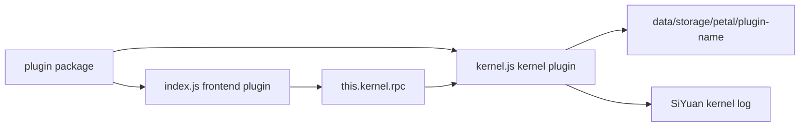

# Kernel Plugin Development

SiYuan 3.7.0 引入了 kernel plugin。一个插件包现在可以同时包含运行在 SiYuan 前端环境中的代码，以及运行在 SiYuan 内核进程中的代码。

本模板在 `/src/kernel.ts` 中提供最小 kernel plugin 示例。完整 API 覆盖请查看官方完整 sample：<https://github.com/siyuan-note/plugin-sample>。

## Glossary

| Term | 本模板中的含义 |
| --- | --- |
| kernel plugin | 插件包中的 `kernel.js` 部分，由 SiYuan kernel 在 goja runtime 中执行。 |
| frontend plugin | 插件包中的 `index.js` 部分，在 SiYuan 前端插件环境中执行。 |
| goja runtime | 嵌入 SiYuan kernel 的 JavaScript runtime。它不是浏览器、Electron renderer，也不是 Node.js 进程。 |
| RPC | frontend plugin 调用 kernel plugin 注册方法时使用的 JSON-RPC bridge。 |
| MCP tool | kernel plugin 注册到 SiYuan MCP server 的工具。最小示例不覆盖。 |
| private server handler | kernel plugin 在 `/plugin/private/<plugin-name>/*path` 下注册的 HTTP/WS/SSE handler。最小示例不覆盖。 |

文档和代码注释中应保持这些术语一致。中文说明可以解释术语，但不要为同一个概念另造多个译名。

## Runtime Model



kernel plugin 会在以下条件都满足时启动：

- 插件已启用。
- `plugin.json` 中的 `kernels` 字段匹配当前 backend 或包含 `all`。
- 插件包中存在 `kernel.js`。
- 当前 SiYuan 版本满足 `minAppVersion`。

如果缺少 `kernel.js` 或 `kernels`，插件包仍可作为 frontend plugin 运行。

## Package Layout

构建产物应包含：

```text
plugin.json
index.js
index.css
kernel.js
i18n/*
README*.md
icon.png
preview.png
```

`plugin.json` 声明 kernel 支持：

```json
{
  "minAppVersion": "3.7.0",
  "kernels": ["windows", "linux", "darwin", "ios", "android", "harmony", "docker", "all"]
}
```

## Minimal Example

`/src/kernel.ts` 演示最高频路径：

- lifecycle hooks：`onload`、`onrunning`、`onunload`
- 通过 `siyuan.logger` 写 kernel log
- 通过 `siyuan.storage` 使用插件私有存储
- 通过 `siyuan.rpc.bind` 暴露方法给 frontend plugin 调用
- 通过 `siyuan.rpc.broadcast` 从 kernel plugin 通知 frontend plugin

frontend 集成位于 `/src/index.ts`：

- `this.kernel.rpc.call.echo(...)` 调用 kernel plugin。
- `this.kernel.rpc.call.readSampleStorage()` 读取 kernel plugin 写入的数据。
- `this.kernel.rpc.bind("notify", handler)` 接收 kernel 通知。
- `kernel-plugin-state-change` 报告 kernel plugin lifecycle state。

## Build

`vite.config.ts` 包含两个 build entry：

| Entry | Output | Runtime |
| --- | --- | --- |
| `/src/index.ts` | `index.js` | SiYuan frontend plugin environment |
| `/src/kernel.ts` | `kernel.js` | SiYuan kernel goja runtime |

kernel 输出约束：

- 单个 JavaScript 文件
- 没有运行时 `import`
- 不使用 `window`、`document` 等 DOM API
- 不使用 Electron renderer API
- 不直接使用 Node.js filesystem API

需要文件、网络、日志和通信能力时，优先使用 `siyuan.storage`、`siyuan.client`、`siyuan.logger` 和 `siyuan.rpc`。

## Development

运行：

```bash
pnpm run dev
```

开发构建会写出 `dev/kernel.js`。SiYuan 会 watch 插件目录中的 `kernel.js`，文件变化时重新加载 kernel plugin。

调试路径：

- frontend logs：浏览器/Electron devtools console
- kernel logs：通过 `siyuan.logger` 写入 SiYuan kernel log
- state changes：frontend plugin event bus 中的 `kernel-plugin-state-change`

## Packaging and Publishing

发布仍使用普通 SiYuan 集市插件流程：

1. 运行 `pnpm run build`。
2. 确认 `dist/kernel.js` 存在。
3. 确认 `package.zip` 包含 `kernel.js`。
4. 创建 GitHub release 并上传 `package.zip`。
5. 首次发布时向 `siyuan-note/bazaar` 提交仓库索引。

因为 kernel plugin 要求 SiYuan 3.7.0+，包含 `kernel.js` 时应保持 `minAppVersion` 不低于 `3.7.0`。

## Advanced APIs

最小示例有意不覆盖：

- MCP tool registration
- private HTTP/WebSocket/SSE server handlers
- streaming proxy responses
- storage watchers
- long-lived network clients

这些 API 请参考官方完整 sample：<https://github.com/siyuan-note/plugin-sample>。

相关 SiYuan PR：

- <https://github.com/siyuan-note/siyuan/pull/17487>
- <https://github.com/siyuan-note/siyuan/pull/17655>
- <https://github.com/siyuan-note/siyuan/pull/17670>
- <https://github.com/siyuan-note/siyuan/pull/17748>
- <https://github.com/siyuan-note/siyuan/pull/17761>
- <https://github.com/siyuan-note/siyuan/pull/17770>
- <https://github.com/siyuan-note/siyuan/pull/17789>
- <https://github.com/siyuan-note/siyuan/pull/17834>
